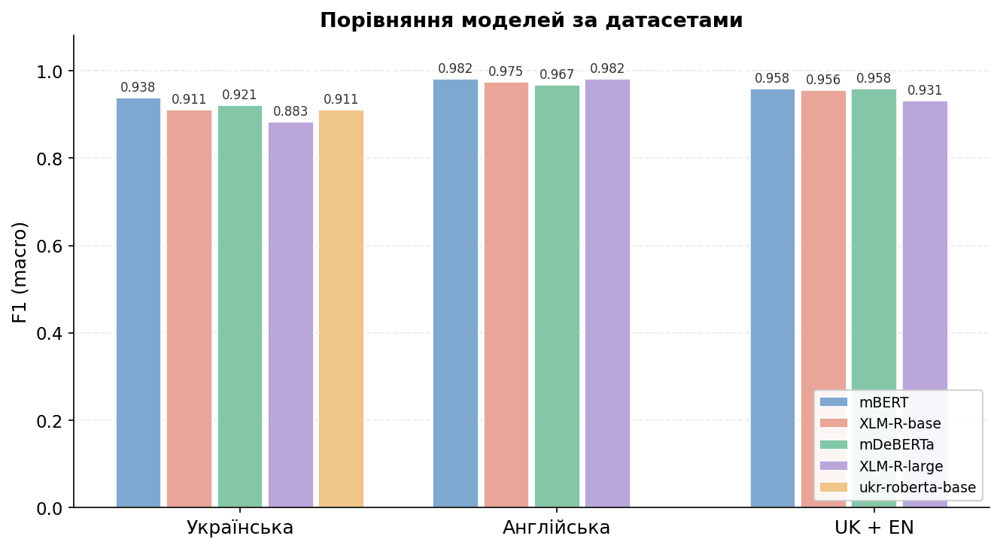

# query-intent

**Класифікація намірів навчальних запитів з інформатики для адаптивних навчальних систем.**

Модель визначає, чого прагне студент у своєму запиті, і дозволяє навчальній системі обирати педагогічно доцільну стратегію відповіді:

- **solution-oriented** (клас 0) — студент хоче готовий результат: код, відповідь, команду;
- **learning-oriented** (клас 1) — студент хоче зрозуміти концепцію, отримати пояснення чи підказку.

Наприклад, на запит «Напиши функцію сортування» система може надати код, а на «Що таке рекурсія?» — пояснення з навідними прикладами.

---

## Зміст

- [Можливості](#можливості)
- [Швидкий старт](#швидкий-старт)
- [Результати](#результати)
- [Датасет](#датасет)
- [Структура проєкту](#структура-проєкту)
- [Тренування власної моделі](#тренування-власної-моделі)
- [Ліцензія](#ліцензія)

## Можливості

- Підтримка **української** та **англійської** мов
- Донавчені трансформерні моделі: mBERT, XLM-RoBERTa, mDeBERTa
- Класифікація одним рядком коду
- Опублікована модель на Hugging Face Hub — працює без локального тренування
- Підтримка CPU та GPU (CUDA / Apple Silicon MPS)

## Швидкий старт

```bash
git clone https://github.com/ilonamarchenko/query-intent.git
cd query-intent
pip install -e .
```

```python
from query_intent import QueryClassifier

clf = QueryClassifier("nyilona/query-intent-uk")   # модель завантажиться з Hugging Face

result = clf("Що таке рекурсія і навіщо вона потрібна?")
print(result.intent)       # 'learning_oriented'
print(result.confidence)   # 0.98

# пакетна класифікація
clf.predict_batch([
    "Напиши функцію сортування на Python",
    "Чим відрізняється список від кортежу?",
])
```

## Результати

Макро F1-міра найкращих моделей за стандартних гіперпараметрів (повний датасет):

| Датасет | Найкраща модель | F1 (macro) |
|---------|-----------------|:----------:|
| Українська | mBERT | **0.938** |
| Англійська | mBERT | **0.982** |
| UK + EN | mDeBERTa | **0.958** |

Ключове спостереження: найменша мультимовна модель (mBERT) перевершує найбільшу (XLM-RoBERTa-large) на україномовному датасеті — за обмежених навчальних даних розмір моделі не визначає якість.



## Датасет

| Мова | Записів | Класи (0/1) | Джерела |
|------|:-------:|:-----------:|---------|
| Українська | 1213 | 57% / 43% | синтетичні дані, форуми (replace.org.ua, DOU), ручна розмітка |
| Англійська | 1851 | 56% / 44% | StackOverflow, StackExchange, MBPP, WildChat |

Усі запити тематично обмежені сферою інформатики та програмування. Готові датасети та розбиття на навчальну/валідаційну/тестову вибірки знаходяться у `data/processed/` та `data/splits/`.

### Як збирався датасет

Україномовний датасет сформовано з кількох джерел: синтетично згенерованих навчальних інструкцій (на основі WizardLM та Alpaca), реальних діалогів користувачів із мовними моделями (WildChat), запитань із технічних форумів (replace.org.ua, DOU) та власноруч складених прикладів, частина яких побудована на основі реальних завдань контрольної роботи з програмування. Англомовний датасет поєднує реальні запити з StackOverflow і сімейства StackExchange, задачі з бенчмарку MBPP, синтетичні запити та діалоги WildChat.

Зібрані тексти проходили фільтрацію (тематичну — за словником CS-термінів, вилучення привітань, нерелевантного та дубльованого контенту), після чого кожному запиту вручну присвоювалася мітка наміру за бінарною схемою з урахуванням правила домінуючого наміру для граничних випадків. Дані розподілено на вибірки у співвідношенні 70/15/15 зі стратифікацією за класами.

## Структура проєкту

```
query_intent/          бібліотека (QueryClassifier, IntentResult)
src/models/            навчання, оцінювання, аналіз помилок, візуалізація
configs/training.yaml  гіперпараметри
data/processed/        датасети
data/splits/           навчальна / валідаційна / тестова вибірки
results/summary.csv    зведені результати експериментів
results/plots/         графіки
```

## Тренування власної моделі

```bash
python src/models/train.py \
  --model bert-base-multilingual-cased \
  --output results/uk_mbert \
  --dataset uk

python src/models/evaluate.py \
  --checkpoint results/uk_mbert/best \
  --output results/uk_mbert/metrics.json \
  --dataset uk
```

Запуск повної серії експериментів — `bash run_all.sh`.

## Ліцензія

MIT
